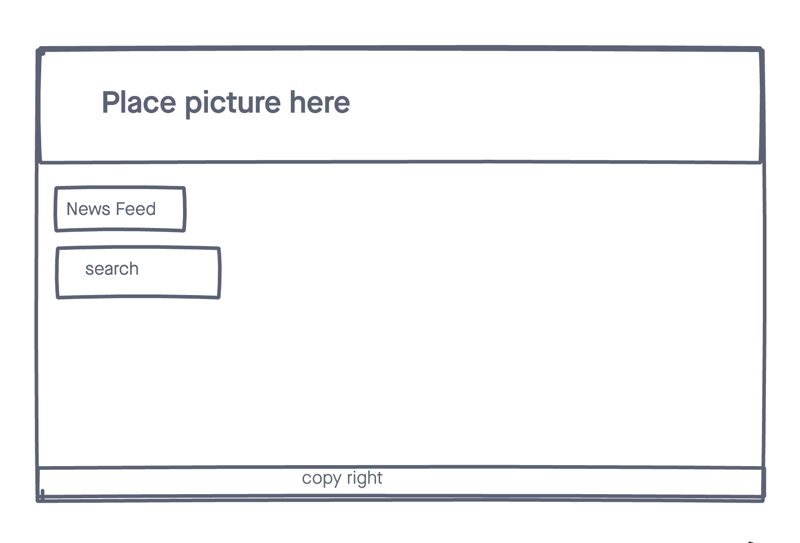

# Newsfeed

A simple web app that pulls Url news articles from the "The Guardian". "The Guardian" is British news, which is owned by the Scott Trust Limited. The Guadian's demographic target is well educated liberal audience with the average age of 44.
Simply place your desired topic of interest in the empty container, press search and enjoy news articles from "The Guardian".

## Technologies used
- HTML5
- CSS3
- JS
- jQuery
- [News](https://newsapi.org/)
- Github Pages (for deployment)

## Screenshots

## Getting started

[click] (https://u241c.github.io) here to get started and see the app online! 

## Future Enhancements

To make cards were user can pull up Urls, images, etc.. To be user friendly on mobile devices.

